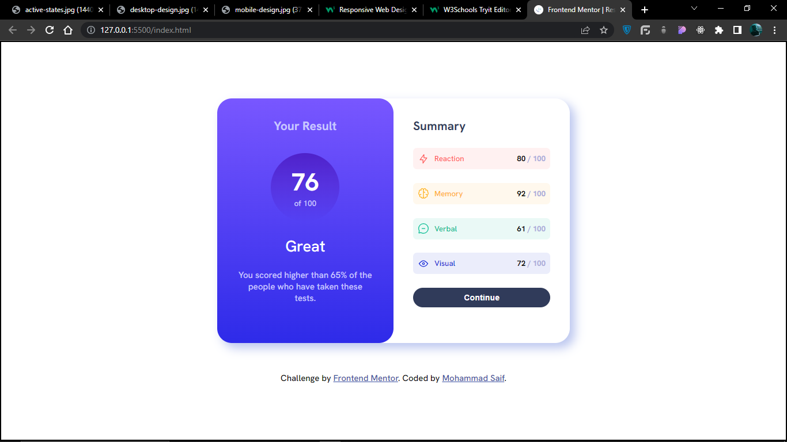
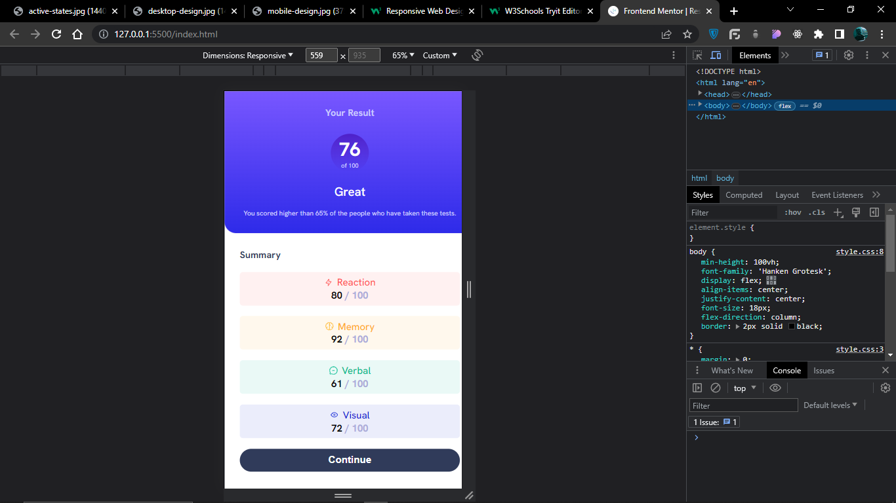
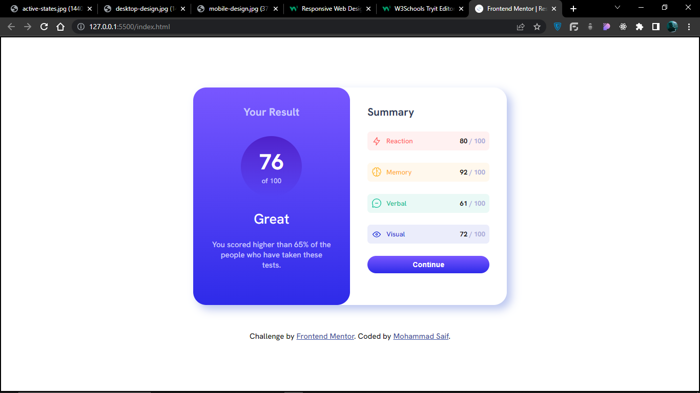

# Frontend Mentor - Results summary component solution

This is a solution to the [Results summary component challenge on Frontend Mentor](https://www.frontendmentor.io/challenges/results-summary-component-CE_K6s0maV). Frontend Mentor challenges help you improve your coding skills by building realistic projects.

### The challenge

Users should be able to:

- View the optimal layout for the interface depending on their device's screen size
- See hover and focus states for all interactive elements on the page

### Screenshot

### Links

- Solution URL: [https://github.com/Thebeast01/Result-Summay.git]
- Live Site URL: [https://thebeast01.github.io/Result-Summay/]

### What I learned

\*\* Learned about the media query and how to add responsiveness to the page.

## Author

- Frontend Mentor - [@Thebeast01](https://www.frontendmentor.io/profile/Thebeast01)
